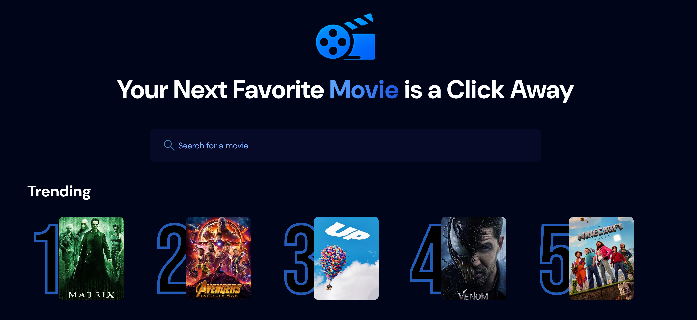

# MovieVerse

A modern, responsive web application that allows users to explore the vast universe of movies. Built with React and powered by the TMDB API.

### Home Page


### Search Results


### Movie Info Page


## Features

- 🔍 Search movies with instant results
- 🎬 View detailed movie information including:
  - Title, rating, and vote count
  - Genres
  - Overview
  - Release date
  - Language
  - Budget and revenue
  - Production companies
  - Tagline
- 🎥 Watch official movie trailers directly on the page
- 📱 Fully responsive design for all screen sizes
- 🎨 Modern and clean user interface
- ⚡ Fast and smooth user experience

## Technologies Used

- React
- React Router
- Tailwind CSS
- TMDB API
- YouTube Embed API
- Vite

## Getting Started

### Prerequisites

- Node.js (v14 or higher)
- npm or yarn
- TMDB API key

### Installation

1. Clone the repository:

```bash
git clone https://github.com/yourusername/movieverse.git
cd movieverse
```

2. Install dependencies:

```bash
npm install
# or
yarn install
```

3. Create a `.env` file in the root directory and add your TMDB API key:

```env
VITE_TMDB_API_KEY=your_api_key_here
```

4. Start the development server:

```bash
npm run dev
# or
yarn dev
```

5. Open [http://localhost:5173](http://localhost:5173) in your browser.

## Project Structure

```
movieverse/
├── src/
│   ├── components/
│   │   ├── MovieCard.jsx
│   │   ├── MovieInfo.jsx
│   │   └── SearchBar.jsx
│   ├── App.jsx
│   └── main.jsx
├── public/
│   └── poster_unavailable.png
├── .env
├── package.json
└── README.md
```

## API Integration

This project uses the TMDB (The Movie Database) API to fetch movie data. You'll need to:

1. Create an account at [TMDB](https://www.themoviedb.org/)
2. Request an API key
3. Add the API key to your `.env` file

## Contributing

Contributions are welcome! Please feel free to submit a Pull Request.

## License

This project is licensed under the MIT License - see the [LICENSE](LICENSE) file for details.

## Acknowledgments

- [TMDB](https://www.themoviedb.org/) for providing the movie data API
- [React](https://reactjs.org/) for the amazing framework
- [Tailwind CSS](https://tailwindcss.com/) for the utility-first CSS framework
- [Vite](https://vitejs.dev/) for the build tool
